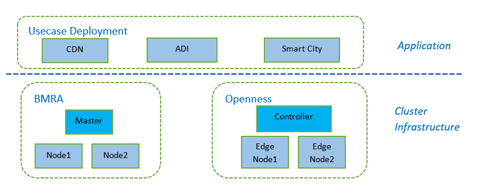
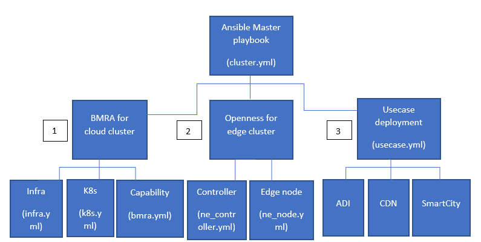
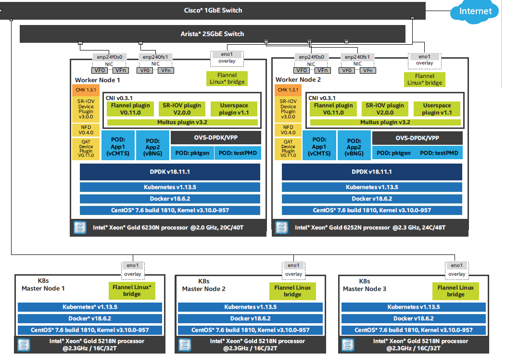
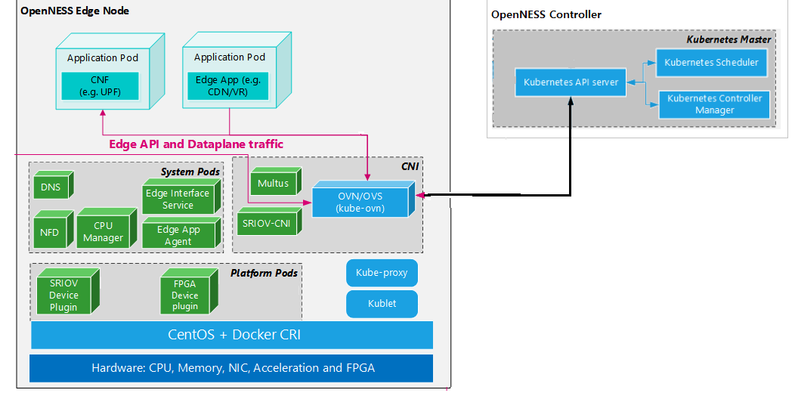
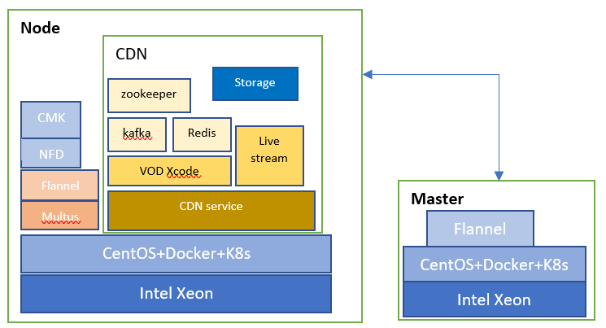
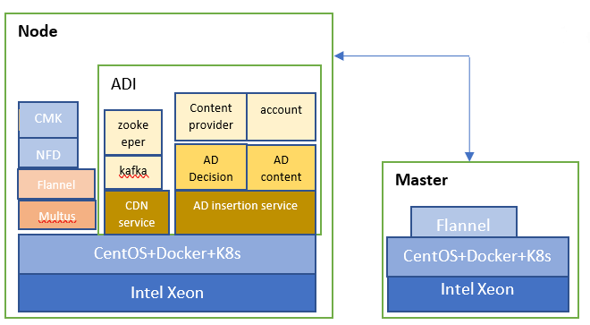
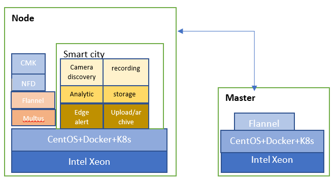
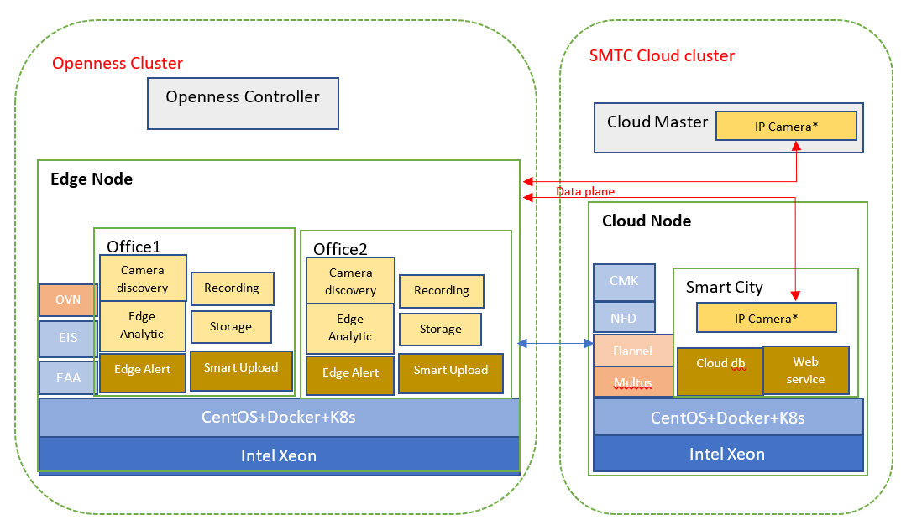

```text
SPDX-License-Identifier: Apache-2.0       
Copyright (c) 2020 Intel Corporation
```
- [Introduction](#introduction)
- [Overview](#overview)
- [Deployment](#deployment)
   - [Ansible Host Prerequisites](#ansible-host-prerequisites)
   - [Get playbook and config variables](#get-playbook-and-config-variables)
   - [BMRA Deployment](#bmra-deployment)
   - [Openness Deployment](#openness-deployment)
   - [Use case Deployment](#use-case-deployment)
- [Use case](#use-case)
   - [CDN deployed on BMRA Flannel CNI](#cdn-deployed-on-bmra-flannel-cni)
   - [ADI deployed on BMRA Flannel CNI](#adi-deployed-on-bmra-flannel-cni)
   - [Smart City deployed on BMRA Flannel CNI](#smart-city-deployed-on-bmra-flannel-cni)
   - [Smart City deployed on both cloud and edge](#smart-city-deployed-on-both-cloud-and-edge)
- [Post-deployment Verification](#post-deployment-verification)
   - [Check Kubernetes cluster of BMRA](#check-kubernetes-cluster-of-bmra)
   - [Check Cluster of Openness subsystem](#check-cluster-of-openness-subsystem)
   - [Check kubernetes Cluster of Use case](#check-kubernetes-cluster-of-use-case)
- [Known issues](#known-issues)
- [Requirements](#requirements)
- [Reference](#reference)

# Introduction
Common Integration Release(CIR) aims to supply easy orchestration and application deployment in cloud network and edge environment on Intel architecture platform*. It provides tarball package of ansible playbooks for automating installation and configuration of ingredients from single source which can be deployed on supported Intel BKC platforms. With CIR help, Users can setup network cluster environment to verify application deployment easily; Internal ingredients can verify the system robustness and compatibility with easy installtion and scaling management.

Related basic technology includes but not limited to: Docker* containers, K8s*, Ansible*, BMRA, Openness, OVC, OpenVINO.


# Overview
Common Integration integrates well-known field network cluster orchestration framework of both cloud core and multi-access edge; deploys typical cloud use case apllicaitons on the cluster with variety configuration to demonstrate Intel advanced network techonologies.

It takes usage of Ansible playbooks and roles to supply customer an easy way to setup environment on Intel BKC platforms. BMRA setup, used to install container based Bare Metal NFV platform; Openness, used to setup Edge orchestration for edge service in multiple environment; Use case deployment, used to deploy application and service on cloud network or Edge cluster:



Figure - Common Integration main Components overview

Ansible is an agentless configuration management tool that uses playbooks to perform actions on many machines. CIR provides a set of playbooks to setup  cloud native or edge orchestration and deploy related user applications on them. Following chart shows the high level ansible playbooks topology:



Figure - Common Integration High level Ansible playbooks

1. BMRA: Build a Bare Metal Container based cloud cluster setup on an Intel platform with accelerators. Users can set config to enable/disable advanced network techonology and device plugins, ex. SRIOV, QAT, DPDK, VPP etc. This is the basic for application deployment on cloud. Following the architecture topology:
  
   

   Figure - BMRA Architecture Topology

   
2. Openness: Setup Edge cluster for edge services deployment and network functions across diverse network platform. Openness has OnPremis and Network modes and CIR deploys with network mode, which leverages Kubernetes based cloud-native Container orchestration stack to deploy edge cloud that can host Applications, Services and Network functions. This is the basic for application deployment on edge cluster. Following the Openness network deployment topology:

   

   Figure - Openness Network Deployment Topology

3. Use case: Some high profile cloud usage models are integrated here to demonstrate Common Integration capability for network orchestration and easy scale and manage the cluster with K8S. The deployment topology will be shown in following deployment details. Please refer to [Open Visual Cloud](https://github.com/OpenVisualCloud) for application details.

These components can be combined with variety recipe according to customer focus: 
* User can setup bare matel NFV cluster with `BMRA[1]` only.
* User can setup pure edge sub system with `Openness[2]` only.
* User can deploy sample `Use case[3]` on cloud cluster with `BMRA[1]` .
* User can deploy sample `Use case[3]` on edge system with `Openness[2]`
* User can setup cloud+edge orchestration and deploy use case on it to emulate reality usage with `BMRA[1]` + `Openness[2]` + `Use case[3]`

Typical repice will be shown in following [Use case](#use-case) in details.

# Deployment

## Ansible Host Prerequisites
   CIR uses python 3 as default ansible interpreter. Please change it to python2.7 on CentOS7.6 manually with Step1 in below:
1. Edit and remove or comment "ansible_python_interpreter" in example/inventory.ini.
    ```
    [all:vars]
    ansible_python_interpreter=/usr/bin/python3
    ``` 
2. Prepare ansible host environment with following commands:
    ```
    # sudo yum install epel-release
    # sudo yum install ansible
    # easy_install pip
    # pip2 install jinja2 –upgrade
    # sudo yum install python36 –y
    # pip install netaddr
    ```
3. Enable passwordless login between all nodes in the cluster.
    ```
    # ssh-keygen
    # ssh-copy-id root@node-ip-address
    ```

## Get playbooks and config variables
1. Get CIR Repo to get ansible playbooks:
   ```
    # git clone https://gitlab.devtools.intel.com/system_integration/common_integration_release.git
    # cd common_integration_release
   ```
2. Copy example inventory file to the CIR home location:
   ```
    # cp examples/*.ini ./
   ```
3. Edit the inventory.ini to reflect the requirement with correct Machines IP. 
4. Copy group_vars and host_vars directories to the playbooks home location:
   ```
    # cp -r examples/group_vars examples/host_vars .
   ```
5. Update variables in group_vars/all.yml and usecase.yml and host_vars/nodeX.yml (Detailed will be touched in below deployment details)
   ```
    # vi group_vars/all.yml
    # vi host_vars/node1.yml
   ``` 
    CIR leverages BMRA method to configure intel capabilities or device plugins with variables which are defined in yaml files. Please refer to [Container BMRA Architecture](https://gitlab.devtools.intel.com/OrchSW/CNO/container_experience_kits/-/blob/master/Container%20Bare%20Metal%20Reference%20Architecture%20for%202nd%20Generation%20Intel(R)%20Xeon(R)%20Scalable%20Processor%20Reference%20Architecture.pdf) for details.
   
    Additional Key CIR variables defined below:
    
      | Variable | Choice,Defaults | Description |
      |---|---|---|
      | openness_enabled | Boolean, default “false” | Enable or Disable Openness setup.If "true", Openness sub module will be cloned.|
      | cdn_transcode_enabled | Boolean, default “false” | Enable or Disable Use case CDN deployment. If "true", CDN will be deployed with correct inventories config.|
      | ad_insertion_enabled | Boolean, default “false” | Enable or Disable Use case ADI deployment. If "true", ADI will be deployed with correct inventories config.|
      | smtc_enabled | Boolean, default “false” | Enable or Disable Use case Smart city deployment. If "true", Smart city will be deployed with correct inventories config.|


6. Update and initialize git submodule. This git repository has nested submodules to support kubespray installation and Openness if enabled.
   ```
    # git submodule update --init --recursive
   ```
7. Update multus plugin file, which is temporary WA here because. "Multus plugin" task file has a typo error in Kubespray* source code which is not merged to kubespray v1.16 branch. This issue will be fixed in next CIR release.
   ```
    # cd playbooks/bmra-current/playbooks/k8s/kubespray
    # git cherry-pick 2ab5cc73cd3e2342660b54b2fb4d028d46693d48
   ```   

## BMRA Deployment
1. Edit `inventory.ini` to reflect correct master and nodes IP.
2. Execute ansible playbooks: BMRA includes 3 part in the setup: Infrastructure setup, K8S setup and Intel capability setup. User can run it in one kick:
   ```
    # ansible-playbook -i inventory.ini playbooks/cir.yml
   ```
    Or User can run them one by one:
   ```
    # ansible-playbook -i inventory.ini playbooks/infra/basic.yml
    # ansible-playbook -i inventory.ini playbooks/k8s/k8s.yml
    # ansible-playbook -i inventory.ini playbooks/intel/basic.yml
   ```
## Openness Deployment
1. Edit `openness_inventory.ini` to reflect correct controller and edge nodes IP.
2. Enable `openness_enabled` and `openness_current_enabled` in `group_vars/all.yml`.
3. Execute ansible playbooks:
   ```
    # ansible-playbook -i openness_inventory.ini playbooks/cir.yml
   ```
   You can also run independently following cmd to deploy Openness only:
   ```
    # ansible-playbook -i inventory.ini playbooks/usecase/usecases.yml
   ```   
   
## Use case Deployment
1. Edit `***_inventory.ini` to reflect correct master and nodes IP. 
2. Enable selected Use case variable in `group_vars/usecase.yml`.
3. Execute ansible playbooks:
   User can complete the deploy with both BMRA and Use case in one command:
   ```
    # ansible-playbook -i ***_inventory.ini playbooks/cir.yml
   ```
   You can also run independently:
   ```
    # ansible-playbook -i ***_inventory.ini playbooks/usecase/usecase.yml
   ```      
   ```
     Notes: `***` above can be replaced with selected Use case shortname, ex. "adi", "cdn" or "smtc"
   ```

# Use case

## CDN deployed on BMRA Flannel CNI 
CDN(Content Delivery transcode) Network deployment is high profile visual cloud usage. It supplies live streaming and VOD service to client based on media multi-transcode in network. Please refer to [CDN Source code](https://github.com/OpenVisualCloud/CDN-Transcode-Sample) for details. CIR provides playbooks to deploy CDN based on Flannel CNI with BMRA:

 

 Figure - CDN on BMRA Flannel Deployment

Deployment steps are below:
1. copy `cdn_inventory.ini` to CIR folder and edit it with correct ips:
    ```
    cp examples/cdn_inventory.ini ./
    vi cdn_inventory.ini 
    ``` 
2. Update `group_vars/usercase.yml` to enable cdn:
    ```
    cdn_transcode_enabled: true 
    ```
3. Update the config yaml for group_vars for "flannel" as following (compared with orignial file):
   ```
   sriov_net_dp_enabled: false
   qat_dp_enabled: false
   gpu_dp_enabled: false
   userspace_ovs_dpdk: false
   http_proxy: "http://proxy-example.com"
   https_proxy: "http://proxy-example.com"
   additional_no_proxy: "127.0.0.1,all master and minion's ip list which is seperated with comma"
   ```
 4. Update the config yaml for host_vars for all nodes(nodeX.yml):
    ```
    sriov_cni_enabled: false
    userspace_cni_enabled: false
    vpp_enabled: false
    ovs_dpdk_enabled: false
    ``` 
5. Setup CDN based on BMRA flannel CNI:
    ```
    ansible-playbook -i cdn_inventory.ini playbooks/cir.yml 
    ```

## ADI deployed on BMRA Flannel CNI 
AD insertion supplies advertise add-in to video content at VOD or streaming based on video content analysis. It contains CDN service, Media analytic and AD insertion. Please refer to [ADI Source code](https://github.com/OpenVisualCloud/Ad-Insertion-Sample) for details. Similar as CDN, CIR provides playbooks to deploy ADI based on Flannel CNI with BMRA:

 

 Figure - ADI on BMRA Flannel Deployment

Deployment steps are below:
1. copy `adi_inventory.ini` to CIR folder and edit it with correct ips:
    ```
    cp examples/adi_inventory.ini ./
    vi adi_inventory.ini 
    ``` 
2. Update `group_vars/usercase.yml` to enable adi:
    ```
    ad_insertion_enabled: true 
    ```
3. Update the config yaml for group_vars for "flannel" as following (compared with orignial file):
   ```
   sriov_net_dp_enabled: false
   qat_dp_enabled: false
   gpu_dp_enabled: false
   userspace_ovs_dpdk: false
   http_proxy: "http://proxy-example.com"
   https_proxy: "http://proxy-example.com"
   additional_no_proxy: "127.0.0.1,all master and minion's ip list which is seperated with comma"
   ```
 4. Update the config yaml for host_vars for all nodes(nodeX.yml):
    ```
    sriov_cni_enabled: false
    userspace_cni_enabled: false
    vpp_enabled: false
    ovs_dpdk_enabled: false
    ``` 
5. Setup ADI based on BMRA flannel CNI:
    ```
    ansible-playbook -i adi_inventory.ini playbooks/cir.yml 
    ```


## Smart City deployed on BMRA Flannel CNI 
Smart city is another high profile cloud usage model. SMTC implements aspects of smart city sensing, analytics and management feature. Please refer to [Smart City Source code](https://github.com/OpenVisualCloud/Smart-City-Sample) for details. CIR provides 2 kinds of deployment for SMTC, on cloud cluster or edge cluster. This seciton depicts how to deploy SMTC based on Flannel CNI with BMRA on cloud cluster:

 

 Figure - SMTC on BMRA Flannel Deployment

Deployment steps are below:
1. copy `smtc_inventory.ini` to CIR folder and edit it with correct ips:
    ```
    cp examples/smtc_inventory.ini ./
    vi smtc_inventory.ini 
    ``` 
2. Update `group_vars/usercase.yml` to enable adi:
    ```
    smtc_enabled: true
    ```
3. Update the config yaml for group_vars for "flannel" as following (compared with orignial file):
   ```
   sriov_net_dp_enabled: false
   qat_dp_enabled: false
   gpu_dp_enabled: false
   userspace_ovs_dpdk: false
   http_proxy: "http://proxy-example.com"
   https_proxy: "http://proxy-example.com"
   additional_no_proxy: "127.0.0.1,all master and minion's ip list which is seperated with comma"
   ```
 4. Update the config yaml for host_vars for all nodes(nodeX.yml):
    ```
    sriov_cni_enabled: false
    userspace_cni_enabled: false
    vpp_enabled: false
    ovs_dpdk_enabled: false
    ``` 
5. Setup SMTC based on BMRA flannel CNI:
    ```
    ansible-playbook -i smtc_inventory.ini playbooks/cir.yml 
    ```

## Smart City deployed on both cloud and edge 
Smart City is a sample applications that is built on top of the OpenVINO & Open Visual Cloud software stacks for media processing and analytics. The application is deployed across multiple regional offices (OpenNESS edge nodes). Each office is an aggregation point of multiple IP cameras (simulated) with their analytics. The media processing and analytics workloads are running on the OpenNESS edge nodes for latency consideration.

The full pipeline of the Smart City sample application on OpenNESS is distributed across three regions:

 1. Client-side Cameras Simulator
 2. OpenNESS Cluster
 3. Smart City Cloud Cluster

The Smart City setup with OpenNESS should typically deployed as shown in this Figure. The drawing depicts 2 offices according to the sample playbooks, but there is no limitation to the number of offices.


_Figure - Smart City Setup with OpenNESS_

CIR setups 2 central offices in one edge node, and simulates 2 IP cameras in cloud cluster with OpenNESS 20.03. External camera dataplane is supported with next OpenNESS. Please see the sample deployment topology as following:

 

 Figure - SMTC on BMRA and Openness Deployment

Deployment steps are below:
1. copy `openness_smtc_int_camera_inventory.ini` to CIR folder and edit it with correct ips and hostnames:
    ```
    cp examples/openness_smtc_int_camera_inventory.ini ./
    vi openness_smtc_int_camera_inventory.ini 
    ``` 
2. Update `group_vars/usercase.yml` to enable adi:
    ```
    smtc_enabled: true
    ```
3. Update the config yaml for group_vars for "flannel" as following (compared with orignial file):
   ```
   openness_enabled: true
   openness_current_enabled: true
   openness_skip_time_verify: true
   openness_skip_custom_kernel: true
   openness_skip_tune_kernel: true
   sriov_net_dp_enabled: false
   qat_dp_enabled: false
   gpu_dp_enabled: false
   userspace_ovs_dpdk: false
   http_proxy: "http://proxy-example.com"
   https_proxy: "http://proxy-example.com"
   additional_no_proxy: "127.0.0.1,all master and minion's ip list which is seperated with comma"
   ```
 4. Update the config yaml for host_vars for all nodes(nodeX.yml):
    ```
    sriov_cni_enabled: false
    userspace_cni_enabled: false
    vpp_enabled: false
    ovs_dpdk_enabled: false
    ``` 
5. Setup SMTC based on BMRA and Openness:
    ```
    ansible-playbook -i openness_smtc_int_camera_inventory.ini playbooks/cir.yml 
    ```
   ```
   Notes: Considering simplification, All use cases will be depicted with 1 master and 1 minion. Users can easily scale up the node numbers with inventory files.
   ```

# Post-deployment Verification 
## Check Kubernetes cluster of BMRA
This section shows how to verify all the components deployed by the scripts. All following cmd are executed on master:
1. Check the post-deployment node status of master & minion, which should match the inventory configuration:
   ```
    # kubectl get nodes -o wide
   ```
2. Check pod status of master & minion. All Pod states should be in Running or Completed status:
   ```
    # kubectl get pods --all-namespace
   ```
   Following podes should be listed (BMRA Flannel as example)
   ```
   NAMESPACE	NAME
   kube-system	cmk-bm7jn
   kube-system	cmk-webhook-cdccd9854-872wb
   kube-system	coredns-58687784f9-tkvd8
   kube-system	coredns-58687784f9-x4k8n
   kube-system	dns-autoscaler-79599df498-gjjd9
   kube-system	kube-apiserver-master1
   kube-system	kube-controller-manager-master1
   kube-system	kube-flannel-brj7b
   kube-system	kube-flannel-vhc8h
   kube-system	kube-multus-ds-amd64-9hn5g
   kube-system	kube-multus-ds-amd64-fhp6b
   kube-system	kube-proxy-g75gq
   kube-system	kube-proxy-l2ptb
   kube-system	kube-scheduler-master1
   kube-system	kubernetes-dashboard-556b9ff8f8-bh94j
   kube-system	nfd-node-feature-discovery-6fb4t
   kube-system	nfd-node-feature-discovery-pbmqm
   kube-system	nginx-8664849564-tmh4j
   kube-system	nginx-proxy-node1
   kube-system	nodelocaldns-228bq
   kube-system	nodelocaldns-5fjnd
   kube-system	registry-c4xkf
   kube-system	registry-proxy-dkllt
   kube-system	tiller-deploy-58f6ff6c77-xnz2q
   ```

## Check Cluster of Openness subsystem
1. Check the post-deployment node status of edge controller & edge nodes, which should match the inventory configuration:
   ```
    # kubectl get nodes -o wide
   ```
2. Check pod status of controller & nodes. All Pod states should be in Running or Completed status:
   ```
    # kubectl get pods --all-namespace
   ```
   Following podes should be listed:
   ```
   NAMESPACE	NAME	STATUS
   kube-ovn	kube-ovn-cni-78sds	Running
   kube-ovn	kube-ovn-cni-v5dwh	Running
   kube-ovn	kube-ovn-controller-697945cd7b-76nnw	Running
   kube-ovn	kube-ovn-controller-697945cd7b-mr5d8	Running
   kube-ovn	kube-ovn-pinger-qhd6r	Running
   kube-ovn	kube-ovn-pinger-qz2vj	Running
   kube-ovn	ovn-central-759d97c7bd-vpzlh	Running
   kube-ovn	ovs-ovn-4f588	Running
   kube-ovn	ovs-ovn-zjldw	Running
   kube-system	coredns-5644d7b6d9-54l8s	Running
   kube-system	coredns-5644d7b6d9-g5krh	Running
   kube-system	etcd-ar09-04-wp	Running
   kube-system	kube-apiserver-ar09-04-wp	Running
   kube-system	kube-controller-manager-ar09-04-wp	Running
   kube-system	kube-multus-ds-amd64-lds5b	Running
   kube-system	kube-multus-ds-amd64-zwtpq	Running
   kube-system	kube-proxy-bmbrk	Running
   kube-system	kube-proxy-d5vrp	Running
   kube-system	kube-scheduler-ar09-04-wp	Running
   openness	eaa-78b89b4757-rvrsx	Running
   openness	edgedns-97vn8	Running
   openness	interfaceservice-frfn5	Running
   openness	nfd-master-ws6mg	Running
   openness	nfd-worker-ptmd7	Running
   openness	syslog-master-hjdkt	Running
   openness	syslog-ng-j7gvg	Running
   ```
## Check kubernetes Cluster of Use case
### Check CDN Use case status
1. Check pod status of all nodes. Pod states should be in Running or Completed status:
   ```
    # kubectl get pods --all-namespace
   ```
   Following podes should be listed:
   ```
    NAME	READY	RESTARTS
   	cdn-service-8d5cc5997-wn4rm	Running
   	kafka-service-847c468f69-w8xzb	Running
   	live0-service-b5dd6ff4f-hhdqp	Running
   	redis-service-6d5d6987cc-ztfjl	Running
   	vod0-service-6b5558475b-mh642	Running
   	zookeeper-service-59dd57f8bf-pv9c2	Running
   ```
2. Open the URL `https://master_ip` in Chrome, click the playlist, video can be played well. 
3. Open stream `https://master_ip/hls/output_name_0_0/index.m3u8` in VLC, video can be played well.

### Check ADI Use case status
1. Check pod status of all nodes. Pod states should be in Running or Completed status:
   ```
    # kubectl get pods --all-namespace
   ```
   Following podes should be listed:
   ```
    NAME	READY	RESTARTS
   	account-77467d8ffc-89qjp	Running
   	ad-content-877bb8cdc-ft7ts	Running
   	ad-decision-6d57c78fd5-tfcd5	Running
   	ad-insertion-9df6f597c-srrrn	Running
   	ad-transcode-696cdff795-ccrlc	Running
   	analytics-7c47f6dc7f-7fxf2	Running
   	cdn-56c4cdc77c-wrtwj	Running
   	content-provider-6c57d64d47-d25pz	Running
   	content-transcode-6c5fd477c5-8c7qn	Running
   	database-5dc7b865dc-trhkq	Running
   	kafka-6674764fbf-km6d2	Running
   	kafka2db-84cc965465-2thxx	Running
   	zookeeper-dfd955768-7g6p2	Running
   ```
2. Open the URL `https://master_ip` in Chrome, click the playlist.

### Check Smart City Use case status
1. Check pod status of all nodes. Pod states should be in Running or Completed status:
   ```
    # kubectl get pods --all-namespace
   ```
   Following podes should be listed:
   ```
   NAME	READY	Status
   default	cloud-db-7d6df9fb94-vnjxp	Running
   default	cloud-storage-777b6b4b-wj98l	Running
   default	cloud-web-7b7cbbdbfd-gkhh7	Running
   default	traffic-office1-alert-7f4b86c859-bsqfn	Running
   default	traffic-office1-analytics1-9b6845d4c-l26d8	Running
   default	traffic-office1-analytics2-5665c4c88b-z4kwc	Running
   default	traffic-office1-analytics3-864b8bd9b4-bwfrr	Running
   default	traffic-office1-analytics4-5567d7ffd5-d7vql	Running
   default	traffic-office1-analytics5-6ff8bfbc9b-cgfz5	Running
   default	traffic-office1-camera-discovery-6dc47b569-vjwbz	Running
   default	traffic-office1-cameras-849dd687c4-5gszk	Running
   default	traffic-office1-db-65f676f979-hss55	Running
   default	traffic-office1-db-init-d2qgf	Running
   default	traffic-office1-mqtt-5ddccc58bf-5gcnw	Running
   default	traffic-office1-smart-upload-d5c7c8dd-zfqjb	Running
   default	traffic-office1-storage-df8fdc997-vqxpg	Running
   default	traffic-office1-where-indexing-674cb7b456-x6wvb	Running
   default	traffic-office2-alert-5d5794d4b9-jbdrj	Running
   default	traffic-office2-analytics1-7f4897bbf5-tf6qk	Running
   default	traffic-office2-analytics2-89575f785-rtcxb	Running
   default	traffic-office2-analytics3-86f7b8d94d-xptph	Running
   default	traffic-office2-analytics4-5567d7ffd5-dweql	Running
   default	traffic-office2-analytics5-6ff8bfbc9b-dgfq5	Running
   default	traffic-office2-camera-discovery-5c8dc7cf9-hmhkk	Running
   default	traffic-office2-cameras-5f49b8b94b-889x7	Running
   default	traffic-office2-db-76dddd5bc5-tfwv9	Running
   default	traffic-office2-db-init-hr5vn	Running
   default	traffic-office2-mqtt-774969d9f6-zct8k	Running
   default	traffic-office2-smart-upload-67bfdb4947-bn95r	Running
   default	traffic-office2-storage-fc9f9b47c-jdltm	Running
   default	traffic-office2-where-indexing-54fdb7f6f9-db2vh	Running
   ```
2. Open the URL `https://master_ip` in Chrome, we can see all sensors and all analytics are available in the web.

# Known issues
* Multus plugin typo issue in BMRA/K8S/kubespray, which need WA manually. This issue will be fixed in next release
* CDN version is suggested to use c45c8b666b9bf704299d65bfe91613b16fbef539 in this release. Other tag or version will be supported in next release.

# Requirements
* Python 2 present on the target servers.
* Suggest to use "python 2.7" as ansible interpreter on CentOS7.6. 
* Ansible 2.9.6 (due to OpenNESS 20.03).
* pip==9.0.3 installed on the Ansible machine.
* SSH keys copied to all Kubernetes cluster nodes (`ssh-copy-id <user>@<host>` command can be used for that).
* Internet access on all target servers is mandatory. Proxy is supported.
* At least 8GB of RAM on the target servers/VMs for minimal number of functions (some Docker image builds are memory-hungry and may cause OOM kills of Docker registry - observed with 4GB of RAM), more if you plan to run heavy workloads such as NFV applications.

# Reference
* [BMRA Architecture Document](https://gitlab.devtools.intel.com/OrchSW/CNO/container_experience_kits/-/blob/master/Container%20Bare%20Metal%20Reference%20Architecture%20for%202nd%20Generation%20Intel(R)%20Xeon(R)%20Scalable%20Processor%20Reference%20Architecture.pdf)
* [OpenNESS Github link](https://github.com/open-ness)
* [Open Visual Cloud Github link](https://github.com/OpenVisualCloud/)
* [OpenVINO toolkit](https://docs.openvinotoolkit.org/latest/index.html)
* [Node Feature Discovery Application Note](https://builders.intel.com/docs/networkbuilders/node-feature-discovery-application-note.pdf)
* [Intel Device Plugins for Kubernetes Application Note](https://builders.intel.com/docs/networkbuilders/intel-device-plugins-for-kubernetes-appnote.pdf)
