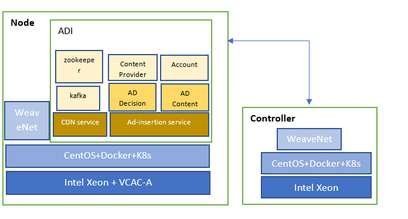

```text
SPDX-License-Identifier: Apache-2.0       
Copyright (c) 2020 Intel Corporation
```
- [Introduction](#introduction)
- [Overview](#overview)
- [Deployment](#deployment)
   - [Ansible Host Prerequisites](#ansible-host-prerequisites)
   - [Get Playbook and Config Variables](#get-playbook-and-config-variables)
   - [BMRA Deployment](#bmra-deployment)
   - [OpenNESS Deployment](#openness-deployment)
   - [Use Case Deployment](#use-case-deployment)
- [Use case](#use-case)
   - [CDN Deployment on BMRA Basic Infrastructure](#cdn-deployment-on-bmra-basic-infrastructure)
   - [ADI Deployment on BMRA Basic Infrastructure](#adi-deployment-on-bmra-basic-infrastructure)
   - [ADI Deployment on OpenNESS with VCAC-A](#adi-deployment-on-openness-with-vcac-a)
   - [Smart City Deployment on BMRA Basic Infrastructure](#smart-city-deployment-on-bmra-basic-infrastructure)
   - [Smart City Deployment on Cloud And Edge](#smart-city-deployment-on-cloud-and-edge)
   - [VCMTS Deployment on BMRA Remote Forwarding Platform Infrastructure](#vcmts-deployment-on-bmra-remote-forwarding-platform-infrastructure)
- [Post-deployment Verification](#post-deployment-verification)
   - [Check BMRA Cluster](#check-bmra-cluster)
   - [Check OpenNESS Cluster](#check-openness-cluster)
   - [Check Use Case Cluster](#check-use-case-cluster)
- [SRIOV Network Device Plugin and SRIOV CNI plugin](#sriov-network-device-plugin-and-sriov-cni-plugin)
- [Known issues](#known-issues)
- [Requirements](#requirements)
- [References](#references)

# Introduction
Common Integration Repository(CIR) aims to supply easy orchestration and application deployment in cloud network and edge environment on Intel architecture platform. It provides tarball package of ansible playbooks for automating installation and configuration of ingredients from single source which can be deployed on supported Intel BKC platforms. With CIR, users can setup network cluster environment to verify application deployment easily, and internal ingredients can verify the system robustness and compatibility with easy installtion and scaling management.

Related basic technology includes but not limited to: Docker Container, Kubernetes, Ansible, BMRA, OpenNESS, OVC, OpenVINO, VCMTS.


# Overview
CIR integrates well-known field network cluster orchestration framework of both cloud core and multi-access edge, and deploys typical cloud use case apllicaitons on the cluster with variety configuration to demonstrate Intel advanced network techonologies.

It takes usage of ansible playbooks and roles to supply customer an easy way to setup environment on Intel BKC platforms. 
* BMRA deployment is used to install container based bare metal NFV platform; 
* OpenNESS deployment is used to setup edge orchestration for edge service in multiple environment; 
* Use case deployment is used to deploy applications and services on cloud network or edge cluster:


Figure 1 -  Common Integration Main Components Overview

Ansible is an agentless configuration management tool that uses playbooks to perform actions on remote machines. CIR provides a set of playbooks to setup cloud native or edge orchestration and deploy related user applications on them. Following chart shows the high level ansible playbook topology:


Figure 2 -  Common Integration High level Ansible playbooks

1. BMRA: Build a bare metal container based cloud cluster setup on Intel platforms with accelerators. Multiple profiles are supplied for different users. Users can select profiles to config different advanced network techonology and device plugins, ex. SRIOV, QAT, DPDK, VPP etc. This is the basis for application deployment on cloud. Following is the architecture topology:
  
   

   Figure 3 - BMRA Architecture Topology

   
2. OpenNESS: Setup edge cluster for edge services deployment and network functions across diverse network platform. OpenNESS supports both on-premises and network modes. CIR deploys with network mode, which leverages Kubernetes based cloud-native container orchestration stack to deploy edge cloud that can host applications, services and network functions. This is the basis for application deployment on edge cluster. Following is the OpenNESS network deployment topology:

   

   Figure 4 - OpenNESS Network Deployment Topology

3. Use Case: Some high profile cloud usage models are integrated here to demonstrate Common Integration capability for network orchestration and easy scale and manage the cluster with K8S, including CDN, ADI, SmartCity, VCMTS. 

These components can be combined with variety recipes according to customer focus: 
* User can setup bare matel NFV cluster with `BMRA[1]` only.
* User can setup pure edge sub system with `Openness[2]` only.
* User can deploy sample `Use case[3]` on cloud cluster with `BMRA[1]` .
* User can deploy sample `Use case[3]` on edge system with `Openness[2]`
* User can setup cloud+edge orchestration and deploy use case on it to emulate reality usage with `BMRA[1]` + `Openness[2]` + `Use case[3]`

Typical repices will be shown in following [Use Case](#use-case) in details.

# Deployment

## Ansible Host Prerequisites
   CIR uses python 3 as default ansible interpreter. Please change it to python2.7 on CentOS7.6 manually with step1 in below:
1. Edit and remove or comment "ansible_python_interpreter" in example/inventory.ini.
    ```
    [all:vars]
    ansible_python_interpreter=/usr/bin/python3
    ``` 
2. Prepare ansible host environment with following commands:
    ```
    # sudo yum install epel-release
    # sudo yum install ansible
    # easy_install pip
    # pip2 install jinja2 –upgrade
    # sudo yum install python36 –y
    # pip install netaddr
    ```
3. Enable passwordless login between all nodes in the cluster.
    ```
    # ssh-keygen
    # ssh-copy-id root@node-ip-address
    ```

## Get Playbooks and Config Variables
1. Get CIR repo to get ansible playbooks:
   ```
    # git clone https://github.com/intel/common-integration-repository.git
    # cd common_integration_repository
   ```
2. Copy example inventory file to the CIR home location:
   ```
    # cp examples/<usecase>/*.ini ./
   ```
3. Edit the inventory.ini to reflect the requirement with correct machines ip. 
4. Copy group_vars and host_vars directories to the CIR home location:
   ```
    # cp -r examples/<usecase>/<profile>/group_vars examples/<usecase>/host_vars .
   ```
5. Update variables in group_vars/all/all.yml and usecase.yml and host_vars/nodeX.yml (Detailed info will be touched in below deployment details)
   ```
    # vi group_vars/all/all.yml
    # vi host_vars/node1.yml
   ``` 
    CIR leverages BMRA method to configure intel capabilities or device plugins with variables which are defined in yaml files. Please refer to [Container BMRA Architecture](https://networkbuilders.intel.com/solutionslibrary/container-bare-metal-for-2nd-generation-intel-xeon-scalable-processor) for details.
   
    Additional key CIR variables are defined in below:
    
      | Variable | Choice,Defaults | Description |
      |---|---|---|
      | openness_enabled | Boolean, default “false” | Enable or Disable OpennNESS setup.If "true", OpenNESS cluster will be deployed.|
      | cdn_transcode_enabled | Boolean, default “false” | Enable or Disable Use case CDN deployment. If "true", CDN will be deployed with correct inventories config.|
      | ad_insertion_enabled | Boolean, default “false” | Enable or Disable Use case ADI deployment. If "true", ADI will be deployed with correct inventories config.|
      | smtc_enabled | Boolean, default “false” | Enable or Disable Use case Smart city deployment. If "true", Smart city will be deployed with correct inventories config.|
      | vcmts_enabled | Boolean, default “false” | Enable or Disable Use case VCMTS deployment. If "true", VCMTS will be deployed with correct inventories config.|


6. Update and initialize git submodule. This git repository has nested submodules to support kubespray installation and OpenNESS if enabled.
   ```
    # git submodule update --init --recursive
   ```

## BMRA Deployment
1. Edit `inventory.ini` to reflect correct master and nodes ip.
2. Execute ansible playbooks: BMRA includes 3 parts in the setup: Infrastructure setup, K8S setup and Intel capability setup. It supports basic, remote_fp, on_prem and full_nfs profiles. User can run it in one kick:
   ```
    # ansible-playbook -i inventory.ini playbooks/cir.yml --extra-vars "profile=<profile>"
    Or
    # ansible-playbook -i inventory.ini playbooks/orchestration/bmra/playbooks/<profile>.yml
   ```
    Or User can run them one by one:
   ```
    # ansible-playbook -i inventory.ini playbooks/orchestration/bmra/playbooks/infra/<profile>.yml
    # ansible-playbook -i inventory.ini playbooks/orchestration/bmra/playbooks/k8s/k8s.yml
    # ansible-playbook -i inventory.ini playbooks/orchestration/bmra/playbooks/intel/<profile>.yml
    # ansible-playbook -i inventory.ini playbooks/usecase/usecase.yml
   ```
## OpenNESS Deployment
1. Edit `openness_inventory.ini` to reflect correct controller and edge nodes ip.
2. Enable `openness_enabled` and `openness_current_enabled` or `openness_next_enabled` in `group_vars/all/orchestration.yml`.
3. Execute ansible playbook:
   ```
    # ansible-playbook -i openness_inventory.ini playbooks/cir.yml --extra-vars "profile=<profile>"
   ```
    You can also run independently commands as following:
   ```
    # ansible-playbook -i openness_inventory.ini playbooks/orchestration/orchestration.yml --extra-vars "profile=<profile>"
    # ansible-playbook -i openness_inventory.ini playbooks/usecase/usecase.yml
   ``` 
## Use Case Deployment
1. Edit `***_inventory.ini` to reflect correct master and nodes ip. 
2. Enable selected use case variable in `group_vars/usecase.yml`.
3. Execute ansible playbook:
   User can complete the deploy with both BMRA and use case in one command:
   ```
    # ansible-playbook -i ***_inventory.ini playbooks/cir.yml --extra-vars "profile=<profile>"
   ```
   You can also run independently commands as following:
   ```
    # ansible-playbook -i ***_inventory.ini playbooks/orchestration/orchestration.yml --extra-vars "profile=<profile>"
    # ansible-playbook -i ***_inventory.ini playbooks/usecase/usecase.yml
   ```      
   ```
     Notes: `***` above can be replaced with selected Use case shortname, ex. "adi", "cdn" or "smtc" or "vcmts"
   ```

# Use Case

## CDN Deployment on BMRA Basic Infrastructure 
CDN(Content Delivery Transcode) network deployment is high profile visual cloud usage. It supplies live streaming and VOD service to client based on media multi-transcode in network. Please refer to [CDN Source code](https://github.com/OpenVisualCloud/CDN-Transcode-Sample) for details. CIR provides playbooks to deploy CDN based on Flannel CNI with BMRA:

 

 Figure 5 - CDN on BMRA Flannel Deployment

Deployment steps are below:
1. copy `cdn_inventory.ini` to CIR folder and edit it with correct ips:
    ```
    cp examples/cdn/cdn_inventory.ini ./
    vi cdn_inventory.ini 
    ``` 
2. copy `group_vars` and `host_vars` to CIR folder, update proxy and node configation file name:
    ```
    cp examples/cdn/basic/group_vars examples/cdn/basic/host_vars -rf ./
    vi group_vars/all/all.yml
      - http_proxy: "http://proxy-example.com"
      - https_proxy: "http://proxy-example.com"
      - additional_no_proxy: "127.0.0.1,all master and minion's ip list which is seperated with comma" 
    cp host_vars/node1.yml host_vars/node_name_in_inventory.yml (run multiple times if you have multiple nodes defined)
    ```
3. Setup CDN based on BMRA flannel CNI:
    ```
    ansible-playbook -i cdn_inventory.ini playbooks/cir.yml --extra-vars "profile=basic"
    ```

## ADI Deployment on BMRA Basic Infrastructure 
AD insertion supplies advertise add-in to video content at VOD or streaming based on video content analysis. It contains CDN service, msedia analytics and AD insertion. Please refer to [ADI Source code](https://github.com/OpenVisualCloud/Ad-Insertion-Sample) for details. Similar as CDN, CIR provides playbooks to deploy ADI based on Flannel CNI with BMRA:

 

 Figure 6 - ADI on BMRA Flannel Deployment

Deployment steps are below:
1. copy `adi_inventory.ini` to CIR folder and edit it with correct ips:
    ```
    cp examples/adi/adi_inventory.ini ./
    vi adi_inventory.ini 
    ``` 
2. copy `group_vars` and `host_vars` to CIR folder, update proxy and node configation file name:
    ```
    cp examples/adi/basic/group_vars examples/adi/basic/host_vars -rf ./
    vi group_vars/all/all.yml
      - http_proxy: "http://proxy-example.com"
      - https_proxy: "http://proxy-example.com"
      - additional_no_proxy: "127.0.0.1,all master and minion's ip list which is seperated with comma" 
    cp host_vars/node1.yml host_vars/node_name_in_inventory.yml (run multiple times if you have multiple nodes defined)
    ```
3. Setup ADI based on BMRA flannel CNI:
    ```
    ansible-playbook -i adi_inventory.ini playbooks/cir.yml --extra-vars "profile=basic"
    ```
## ADI Deployment on OpenNESS with VCAC-A
AD insertion supplies advertise add-in to video content at VOD or streaming based on video content analysis. It contains CDN service, msedia analytics and AD insertion. Please refer to [ADI Source code](https://github.com/OpenVisualCloud/Ad-Insertion-Sample) for details. ADI also supports to deploy with VCAC-A accelerator, CIR provides playbooks to deploy ADI based on VCAC-A with OpenNESS:

 

 Figure 7 - ADI on OpenNESS Deployment

Deployment steps are below:
1. copy `openness_adi_inventory.ini` to CIR folder and edit it with correct ips:
    ```
    cp examples/openness/openness_adi_inventory.ini ./
    vi openness_adi_inventory.ini 
    ``` 
2. copy `group_vars` and `host_vars` to CIR folder, update proxy, VCAC-A, OpenNESS option and node configation file name:
    ```
    cp examples/openness/basic/group_vars examples/openness/basic/host_vars -rf ./
    vi group_vars/all/all.yml
      - http_proxy: "http://proxy-example.com"
      - https_proxy: "http://proxy-example.com"
      - additional_no_proxy: "127.0.0.1,all master and minion's ip list which is seperated with comma" 
      - vcaca_enabled: true
    vi group_vars/all/orchestration.yml
      - openness_enabled: true
      - openness_next_enabled: true
    vi group_vars/all/usecase.yml
      - ad_insertion_enabled: true
      - adi_platform: VCAC-A
    ```
3. Setup ADI based on OpenNESS:
    ```
    ansible-playbook -i adi_inventory.ini playbooks/cir.yml --extra-vars "profile=basic"
    ```

## Smart City Deployment on BMRA Basic Infrastructure 
Smart city is another high profile cloud usage model. SMTC implements aspects of smart city sensing, analytics and management feature. Please refer to [Smart City Source code](https://github.com/OpenVisualCloud/Smart-City-Sample) for details. CIR provides 2 kinds of deployment for SMTC, on cloud cluster or boto cloud and edge clusters. This seciton depicts how to deploy SMTC based on Flannel CNI with BMRA on cloud cluster:

 

 Figure 8 - SMTC on BMRA Flannel Deployment

Deployment steps are below:
1. copy `smtc_inventory.ini` to CIR folder and edit it with correct ips:
    ```
    cp examples/smtc/smtc_inventory.ini ./
    vi smtc_inventory.ini 
    ``` 
2. copy `group_vars` and `host_vars` to CIR folder, update proxy and node configation file name:
    ```
    cp examples/smtc/basic/group_vars examples/smtc/basic/host_vars -rf ./
    vi group_vars/all/all.yml
      - http_proxy: "http://proxy-example.com"
      - https_proxy: "http://proxy-example.com"
      - additional_no_proxy: "127.0.0.1,all master and minion's ip list which is seperated with comma" 
    cp host_vars/node1.yml host_vars/node_name_in_inventory.yml (run multiple times if you have multiple nodes defined)
    ```
3. Setup SMTC based on BMRA flannel CNI:
    ```
    ansible-playbook -i smtc_inventory.ini playbooks/cir.yml --extra-vars "profile=basic"
    ```

## Smart City Deployment on Cloud And Edge
Smart City is a sample applications that is built on top of the OpenVINO & Open Visual Cloud software stacks for media processing and analytics. The application is deployed across multiple regional offices (OpenNESS edge nodes). Each office is an aggregation point of multiple IP cameras (simulated) with their analytics. The media processing and analytics workloads are running on the OpenNESS edge nodes for latency consideration.

The full pipeline of the Smart City sample application on OpenNESS is distributed across three regions:

 1. Client-side Cameras Simulator
 2. OpenNESS Cluster
 3. Smart City Cloud Cluster

The Smart City setup with OpenNESS should typically deployed as shown in this Figure. The drawing depicts 2 offices according to the sample playbooks, but there is no limitation to the number of offices.


_Figure 9 - Smart City Setup with OpenNESS_

CIR setups 2 central offices in one edge node, and simulates 2 IP cameras in cloud cluster with OpenNESS 20.03. External camera dataplane is supported with next OpenNESS. Please see the sample deployment topology as following:

 

 Figure 10 - SMTC on BMRA and Openness Deployment

Deployment steps are below:
1. copy `openness_smtc_int_camera_inventory.ini` to CIR folder and edit it with correct ips and hostnames:
    ```
    cp examples/openness/openness_smtc_int_camera_inventory.ini ./
    vi openness_smtc_int_camera_inventory.ini 
    ``` 
2. copy `group_vars` and `host_vars` to CIR folder, update proxy, SMTC, OpenNESS options and node configation file name:
    ```
    cp examples/openness/basic/group_vars examples/openness/basic/host_vars -rf ./
    vi group_vars/all/all.yml
      - http_proxy: "http://proxy-example.com"
      - https_proxy: "http://proxy-example.com"
      - additional_no_proxy: "127.0.0.1,all master and minion's ip list which is seperated with comma" 
      - vcaca_enabled: true (if you want to deploy SMTC with VCAC-A)
    vi group_vars/all/orchestration.yml
      - openness_enabled: true
      - openness_next_enabled: true
    vi group_vars/all/usecase.yml
      - smtc_enabled: true
      - smtc_platform: VCAC-A (if you want to deploy SMTC with VCAC-A)
    cp host_vars/node1.yml host_vars/node_name_in_inventory.yml (run multiple times if you have multiple nodes defined)
    ``` 
3. Setup SMTC based on BMRA and Openness:
    ```
    ansible-playbook -i openness_smtc_int_camera_inventory.ini playbooks/cir.yml --extra-vars "profile=basic"
    ```
   ```
   Notes: Considering simplification, All use cases will be depicted with 1 master and 1 minion. Users can easily scale up the node numbers with inventory files.
   ```

## VCMTS Deployment on BMRA Remote Forwarding Platform Infrastructure 
VCMTS is virtual cable modem termination system, which contains DOCSIS MAC functionality and may be deployed at the Cable Service Provider Head-End. Please refer to [vcmts](https://01.org/access-network-dataplanes) for details. VCMTS includes DPDK, QAT, sriov features and CIR provides playbooks to deploy them based on BMRA remote_fp profile automatically. CIR supports 2 deployment meothods for VCMTS, baremetal and k8s. User can config them in group_vars/all/usecase.yml easily:

Deployment steps are below:
1. copy `vcmts_inventory.ini` to CIR folder and edit it with correct ips:
    ```
    cp examples/vcmts/vcmts_inventory.ini ./
    vi vcmts_inventory.ini 
    ``` 
2. copy `group_vars` and `host_vars` to CIR folder, update proxy, vcmts optins and node configation file name::
    ```
    vi group_vars/all/all.yml
      - http_proxy: "http://proxy-example.com"
      - https_proxy: "http://proxy-example.com"
      - additional_no_proxy: "127.0.0.1,all master and minion's ip list which is seperated with comma" 
    vi group_vars/all/usecase.yml
      - vcmts_enabled: true
      - vcmts_env_type: baremetal (or kubernetes)
      - vcmts_domain: example.com (vcmts hosts domain name)
    cp host_vars/node1.yml host_vars/node_name_in_inventory.yml (run multiple times if you have multiple nodes defined)
    update isolcpu option in nodex.yml
      - isolcpus: "2-21,24-43,46-65,68-87"
      - cpu_count: 88
    ```
3. Setup vcmts :
    ```
    ansible-playbook -i vcmts_inventory.ini playbooks/cir.yml --extra-vars "profile=remote_fp"
    ```

# Post-deployment Verification 
## Check BMRA Cluster
This section shows how to verify all the components deployed by the scripts. All following commands are executed on master:
1. Check the post-deployment node status of master & minion, which should match the inventory configuration:
   ```
    # kubectl get nodes -o wide
   ```
2. Check pod status of master & minion.  All Pods should be in Running or Completed status:
   ```
    # kubectl get pods --all-namespace
   ```
   Following pods should be listed (BMRA Flannel as example)
   ```
   NAMESPACE	NAME
   kube-system	cmk-bm7jn
   kube-system	cmk-webhook-cdccd9854-872wb
   kube-system	coredns-58687784f9-tkvd8
   kube-system	coredns-58687784f9-x4k8n
   kube-system	dns-autoscaler-79599df498-gjjd9
   kube-system	kube-apiserver-master1
   kube-system	kube-controller-manager-master1
   kube-system	kube-flannel-brj7b
   kube-system	kube-flannel-vhc8h
   kube-system	kube-multus-ds-amd64-9hn5g
   kube-system	kube-multus-ds-amd64-fhp6b
   kube-system	kube-proxy-g75gq
   kube-system	kube-proxy-l2ptb
   kube-system	kube-scheduler-master1
   kube-system	kubernetes-dashboard-556b9ff8f8-bh94j
   kube-system	nfd-node-feature-discovery-6fb4t
   kube-system	nfd-node-feature-discovery-pbmqm
   kube-system	nginx-8664849564-tmh4j
   kube-system	nginx-proxy-node1
   kube-system	nodelocaldns-228bq
   kube-system	nodelocaldns-5fjnd
   kube-system	registry-c4xkf
   kube-system	registry-proxy-dkllt
   kube-system	tiller-deploy-58f6ff6c77-xnz2q
   ```

## Check OpenNESS Cluster
1. Check the post-deployment node status of edge controller & edge nodes, which should match the inventory configuration:
   ```
    # kubectl get nodes -o wide
   ```
2. Check pod status of controller & nodes. All Pods should be in Running or Completed status:
   ```
    # kubectl get pods --all-namespace
   ```
   Following pods should be listed:
   ```
   NAMESPACE	NAME	STATUS
   kube-ovn	kube-ovn-cni-78sds	Running
   kube-ovn	kube-ovn-cni-v5dwh	Running
   kube-ovn	kube-ovn-controller-697945cd7b-76nnw	Running
   kube-ovn	kube-ovn-controller-697945cd7b-mr5d8	Running
   kube-ovn	kube-ovn-pinger-qhd6r	Running
   kube-ovn	kube-ovn-pinger-qz2vj	Running
   kube-ovn	ovn-central-759d97c7bd-vpzlh	Running
   kube-ovn	ovs-ovn-4f588	Running
   kube-ovn	ovs-ovn-zjldw	Running
   kube-system	coredns-5644d7b6d9-54l8s	Running
   kube-system	coredns-5644d7b6d9-g5krh	Running
   kube-system	etcd-ar09-04-wp	Running
   kube-system	kube-apiserver-ar09-04-wp	Running
   kube-system	kube-controller-manager-ar09-04-wp	Running
   kube-system	kube-multus-ds-amd64-lds5b	Running
   kube-system	kube-multus-ds-amd64-zwtpq	Running
   kube-system	kube-proxy-bmbrk	Running
   kube-system	kube-proxy-d5vrp	Running
   kube-system	kube-scheduler-ar09-04-wp	Running
   openness	eaa-78b89b4757-rvrsx	Running
   openness	edgedns-97vn8	Running
   openness	interfaceservice-frfn5	Running
   openness	nfd-master-ws6mg	Running
   openness	nfd-worker-ptmd7	Running
   openness	syslog-master-hjdkt	Running
   openness	syslog-ng-j7gvg	Running
   ```
## Check Use Case Cluster
### Check CDN Use Case Status
1. Check pod status of all nodes.  All Pods should be in Running or Completed status:
   ```
    # kubectl get pods --all-namespace
   ```
   Following pods should be listed:
   ```
   NAMESPACE	NAME	STATUS
   default	cdn-service-8d5cc5997-wn4rm	Running
   default	kafka-service-847c468f69-w8xzb	Running
   default	live0-service-b5dd6ff4f-hhdqp	Running
   default	redis-service-6d5d6987cc-ztfjl	Running
   default	vod0-service-6b5558475b-mh642	Running
   default	zookeeper-service-59dd57f8bf-pv9c2	Running
   ```
2. Open the URL `https://master_ip` in Chrome, click the playlist, video can be played well. 
3. Open stream `https://master_ip/hls/output_name_0_0/index.m3u8` in VLC, video can be played well.

### Check ADI Use Case Status
1. Check pod status of all nodes. Pod states should be in Running or Completed status:
   ```
    # kubectl get pods --all-namespace
   ```
   Following pods should be listed:
   ```
   NAMESPACE	NAME	STATUS
   default	account-77467d8ffc-89qjp	Running
   default	ad-content-877bb8cdc-ft7ts	Running
   default	ad-decision-6d57c78fd5-tfcd5	Running
   default	ad-insertion-9df6f597c-srrrn	Running
   default	ad-transcode-696cdff795-ccrlc	Running
   default	analytics-7c47f6dc7f-7fxf2	Running
   default	cdn-56c4cdc77c-wrtwj	Running
   default	content-provider-6c57d64d47-d25pz	Running
   default	content-transcode-6c5fd477c5-8c7qn	Running
   default	database-5dc7b865dc-trhkq	Running
   default	kafka-6674764fbf-km6d2	Running
   default	kafka2db-84cc965465-2thxx	Running
   default	zookeeper-dfd955768-7g6p2	Running
   ```
2. Open the URL `https://master_ip` in Chrome, click the playlist.

### Check Smart City Use Case Status
1. Check pod status of all nodes. All pods should be in Running or Completed status:
   ```
    # kubectl get pods --all-namespace
   ```
   Following pods should be listed:
   ```
   NAMESPACE	NAME	STATUS
   default	cloud-db-7d6df9fb94-vnjxp	Running
   default	cloud-storage-777b6b4b-wj98l	Running
   default	cloud-web-7b7cbbdbfd-gkhh7	Running
   default	traffic-office1-alert-7f4b86c859-bsqfn	Running
   default	traffic-office1-analytics1-9b6845d4c-l26d8	Running
   default	traffic-office1-analytics2-5665c4c88b-z4kwc	Running
   default	traffic-office1-analytics3-864b8bd9b4-bwfrr	Running
   default	traffic-office1-analytics4-5567d7ffd5-d7vql	Running
   default	traffic-office1-analytics5-6ff8bfbc9b-cgfz5	Running
   default	traffic-office1-camera-discovery-6dc47b569-vjwbz	Running
   default	traffic-office1-cameras-849dd687c4-5gszk	Running
   default	traffic-office1-db-65f676f979-hss55	Running
   default	traffic-office1-db-init-d2qgf	Running
   default	traffic-office1-mqtt-5ddccc58bf-5gcnw	Running
   default	traffic-office1-smart-upload-d5c7c8dd-zfqjb	Running
   default	traffic-office1-storage-df8fdc997-vqxpg	Running
   default	traffic-office1-where-indexing-674cb7b456-x6wvb	Running
   default	traffic-office2-alert-5d5794d4b9-jbdrj	Running
   default	traffic-office2-analytics1-7f4897bbf5-tf6qk	Running
   default	traffic-office2-analytics2-89575f785-rtcxb	Running
   default	traffic-office2-analytics3-86f7b8d94d-xptph	Running
   default	traffic-office2-analytics4-5567d7ffd5-dweql	Running
   default	traffic-office2-analytics5-6ff8bfbc9b-dgfq5	Running
   default	traffic-office2-camera-discovery-5c8dc7cf9-hmhkk	Running
   default	traffic-office2-cameras-5f49b8b94b-889x7	Running
   default	traffic-office2-db-76dddd5bc5-tfwv9	Running
   default	traffic-office2-db-init-hr5vn	Running
   default	traffic-office2-mqtt-774969d9f6-zct8k	Running
   default	traffic-office2-smart-upload-67bfdb4947-bn95r	Running
   default	traffic-office2-storage-fc9f9b47c-jdltm	Running
   default	traffic-office2-where-indexing-54fdb7f6f9-db2vh	Running
   ```
2. Open the URL `https://master_ip` in Chrome, we can see all sensors and all analytics are available in the web.

### Check VCMTS Use Case Status with Kubernetes Mode
1. Check pod status of all nodes. All pods should be in Running or Completed status:
   ```
    # kubectl get pods --all-namespace
   ```
   Following pods should be listed:
   ```
   NAMESPACE	NAME	STATUS
   default	cmk-cluster-init-pod	Completed
   default	cmk-init-install-discover-pod-au09-18-wp.jf.intel.com	Completed
   default	cmk-reconcile-nodereport-ds-au09-18-wp.jf.intel.com	Running
   default	cmk-webhook-deployment-6db7dcdbff-kb7rm    Running
   default	qat-device-plugin-x68kq	   Running
   default	sriov-device-plugin-pktgen-glqv2	Running
   default	sriov-device-plugin-vcmts-gpbqc	Running
   default	vcmts-cloud-init-wl9px	Completed
   default	vcmts-cloud-pktgen-init-qlz5p	Completed
   default	vcmts-pktgen-pod-0	Running
   default	vcmts-pktgen-pod-1	Running
   default	vcmts-pktgen-pod-2	Running
   default	vcmts-pktgen-pod-3	Running
   default	vcmts-stats-daemonset-2xjrx	Running
   default	vcmtsd-0	Running
   default	vcmtsd-1	Running
   default	vcmtsd-2	Running
   default	vcmtsd-3	Running
   ```

# SRIOV Network Device Plugin and SRIOV CNI plugin

## Cluster configuration options

In order to install SRIOV Network Device Plugin set `sriov_net_dp_enabled` value to `true` in your group vars file. Setting it to `false` will disable SRIOV Network Device Plugin installation and cause other related options to be ignored.
```
sriov_net_dp_enabled: true
```

You can also change the Kubernetes namespace used for the plugin deployment - by default it's `kube-system`.
```
sriov_net_dp_namespace: kube-system
```

It's possible to build and store image locally or use one from public external registry. If you want to use image from the Docker Hub (recommended and faster option), please use `false`.
```
sriov_net_dp_build_image_locally: false
```

The `example_net_attach_defs` dictionary allows for enabling/disabling automatic creation of example net-attach-def objects. If you want to create the example net-attach-def resource for use with the SRIOV Network Device Plugin and SRIOV CNI, please set below variable to `true`.
```
example_net_attach_defs:
  sriov_net_dp: true
```

## Worker node specific options

There's also a set of configuration options that are applied in per-node manner.

First set of variables enables SRIOV for selected network adapters, by setting `sriov_enabled` as `true`, passing correct `names`, `bus info` and `device info` of the physical function interfaces. There's also options to define how many virtual functions should be created for each physical function and which ddp file will load. 
In below example `sriov_nics` configuration will create 4 VFs for Intel FVL NIC enp175s0f0 PF interface, with PCI bus info as "18:00.0" and attach them to vfio-pci driver and load "gtp.pkgo" ddp file; and create 2 VFs for Intel FVL NIC enp175s0f1 PF interface with PCI bus info as "18:00.1" and attach them to kernel mode iavf driver. It will also add IOMMU kernel flags, and as a result will reboot the target worker node during deployment.
```
sriov_nics:
  - name: enp175s0f0
    bus_info: "18:00.0"
    device_info: "8086:158b:0200"
    sriov_numvfs: 4
    vf_driver: vfio-pci
    ddp_profile: "gtp.pkgo"
    
  - name: enp175s0f1
    bus_info: "18:00.1"
    device_info: "8086:158b:0200"
    sriov_numvfs: 2
    vf_driver: iavf
```

Next option defines whether the SRIOV CNI plugin will be installed on the target worker node. Setting it to `true` will cause the Ansible scripts to build and install SRIOV CNI plugin in the `/opt/cni/bin` directory on the target server.
```
sriov_cni_enabled: true`
```

Please refer to the [SRIOV Network Device Plugin](https://github.com/intel/sriov-network-device-plugin) and [SRIOV CNI documentation](https://github.com/intel/sriov-cni) to get more details and usage examples.

# Known issues
* ICE 1.1.4 driver fails to load on Ubuntu 18.04, which is CVL driver limitation and will be fixed in CVL 2.2.
* Comms DDP profile loading works only on ICE driver 1.0.4+NVM 0.50 OR newer ICE driver than 1.0.4.

# Requirements
* Python 2 present on the target servers.
* Suggest to use "python 2.7" as ansible interpreter on CentOS7.6. 
* Ansible 2.9.6 (due to OpenNESS 20.03).
* pip==9.0.3 installed on the Ansible machine.
* SSH keys copied to all Kubernetes cluster nodes (`ssh-copy-id <user>@<host>` command can be used for that).
* Internet access on all target servers is mandatory. Proxy is supported.
* At least 8GB of RAM on the target servers/VMs for minimal number of functions (some Docker image builds are memory-hungry and may cause OOM kills of Docker registry - observed with 4GB of RAM), more if you plan to run heavy workloads such as NFV applications.

# References
* [BMRA Architecture Document](https://networkbuilders.intel.com/solutionslibrary/container-bare-metal-for-2nd-generation-intel-xeon-scalable-processor)
* [OpenNESS Github link](https://github.com/open-ness)
* [Open Visual Cloud Github link](https://github.com/OpenVisualCloud/)
* [OpenVINO toolkit](https://docs.openvinotoolkit.org/latest/index.html)
* [Node Feature Discovery Application Note](https://builders.intel.com/docs/networkbuilders/node-feature-discovery-application-note.pdf)
* [Intel Device Plugins for Kubernetes Application Note](https://builders.intel.com/docs/networkbuilders/intel-device-plugins-for-kubernetes-appnote.pdf)
